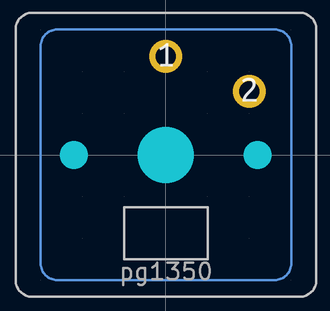
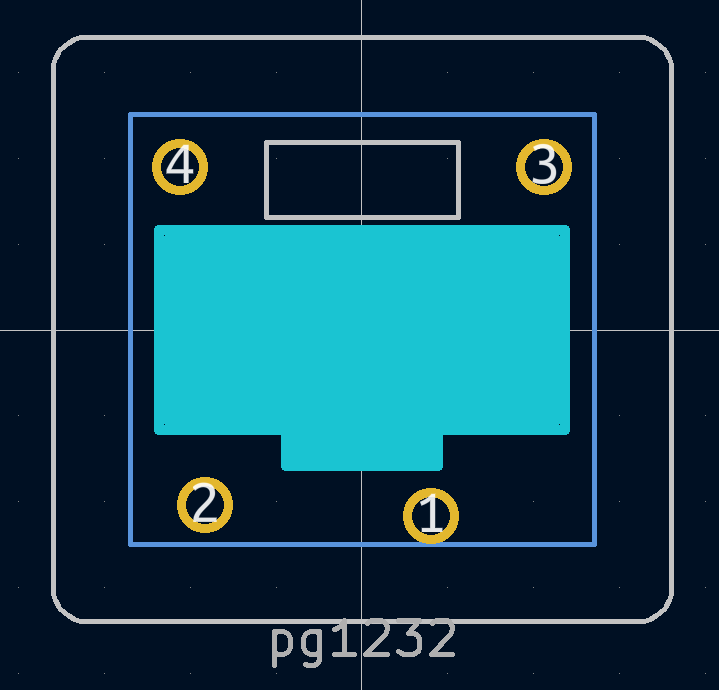
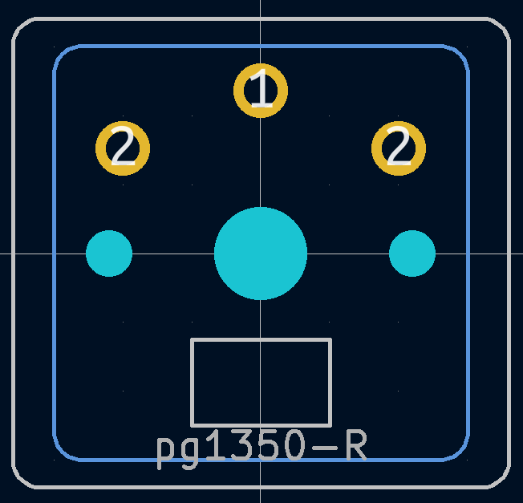
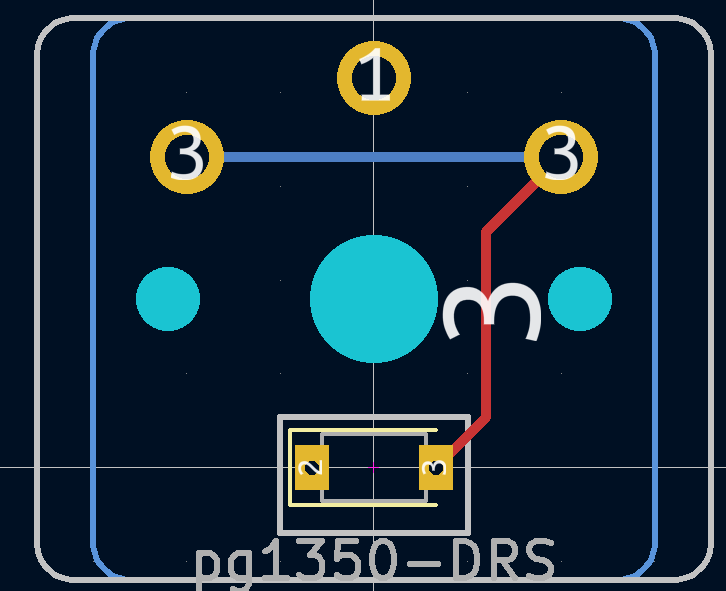
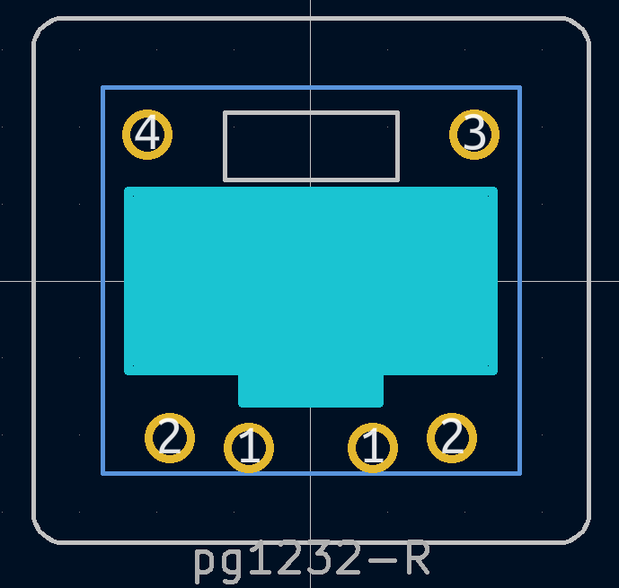

# PG1350 & PG1232 Kicad symbols & footprints

PG1350 & PG1232 symbols and footprints heavily inspired by [@PJE66](https://github.com/PJE66). 

## Symbol

Includes the diode in the symbols. Taken from [@PJE66](https://github.com/PJE66), but with some of the pins hidden as they are not needed for external connections. Even though they are still 2 pin "components", the diode is included for clarity in the schematics. A switch without diode can be just represented with a normal push button.

## Footprints

**Note:** I have not tested any of these yet, but they look similar enough to the previous footprints I have so they _should_ work without problems.

The pg1350 footprint dimensions (i.e. pin sizes & locations) is originally taken from [Keebio](https://github.com/keebio/Keebio-Parts.pretty), and the pg1232 ones from [here](https://github.com/tamanishi/Kailh_PG1232). They are converted to Python and modifications are added.

The outline on `User.Comments` is the outline of the side tabs, and the one on `User.Drawings` is slightly outside of the outline of the keycap, reflecting the spacing.

All of the footprints are auto generated now. Different letters signify different variations.
- `D`: includes diode in the footprint. It uses choc LED hole for (optional) SOD-123 diode placement, and the internal connections are already made. The center of the footprint is placed on the center of the diode to help with PCBA, and it's meant to be used with the custom symbol signifying that it has a builtin diode; 
- `R`: footprint is reversible. Througholes are included for both sides, another pad is used to connect the duplicated hole, and vias are used inside of the diode pads to connect the diodes on both sides, and silkscreens are duplicated on both sides;

All the following variants are spacing variants, which is useless for most people and I keep it here for my own sake.

- `S`: shorter spacing, only affects the cap outline. To be used with 15mm vertical spacing. This as close vertical as chocs gets without modding the switch itself;
- `SS`: even shorter spacing, only affects the cap outline. To be used with 13.5mm vertical spacing. This as close vertical as choc minis (pg1232) gets without modding the switch itself;
- `L` & `R`: only when used with `S`; off centered spacing for use with same finger double column (e.g. most commonly the 2 columns for index finger, or columns for pinky).

The screenshots are taken in Kicad 5.99, but the footprints should be compatible with Kicad 5.

## Models

The `.step` models of the switches are also included in the repo, for both pg1350 & pg1232 switches and with 1u MBK keycaps. The pg1350 model is taken directly from [here](https://grabcad.com/library/kailh-choc-low-profile-switch-1), and the MBK model from [here](https://www.thingiverse.com/thing:4564253/files). The pg1232 model is made by me through cutting and rejoining pieces of the pg1350 model, which should immitate the general model but is otherwise very janky. The joint choc and MBK models are simply the combinations of the switch models and the MBK model.

The models are not included in the switch footprints as it seems that Kicad does not support relative path for the 3D models. So you need to edit the footprint to point to the 3D model you want to use after downloading the library.
